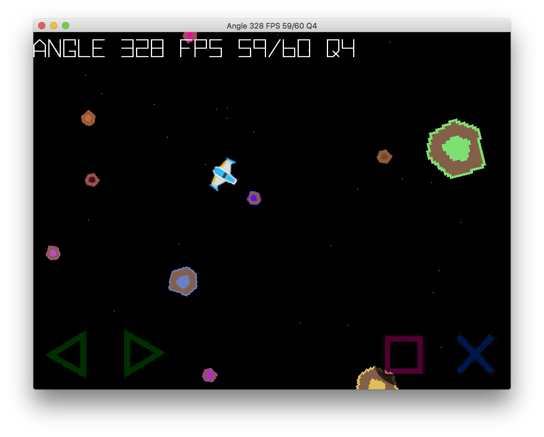

PyGame running with *pygame_sdl2* ported to mobile.

Follow the steps to install pygame_sdl2
[pygame_sdl2](https://github.com/renpy/pygame_sdl2)

Requirements

```shell
pip3 install -r requirements.txt
```

Run

```shell
python3 src/main.py
```


